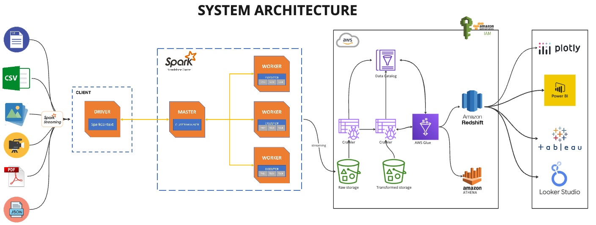

# Real-Time Streaming and Processing of Unstructured Data

## Overview

This project demonstrates a **real-time streaming pipeline** for processing **unstructured data** using **Apache Spark Streaming**, **Apache Kafka**, **AWS Kinesis**, and **AWS services** such as **S3, Glue, and Athena**. The architecture ensures seamless data ingestion, transformation, and real-time analytics.

## Architecture

The system processes **unstructured data** (CSV, JSON, PDFs, images, videos, etc.) using **Apache Spark** in a **distributed cluster environment**. The processed data is stored in **AWS S3** and cataloged using **AWS Glue**, making it available for querying via **Amazon Redshift** and **Amazon Athena**.

## Features

- **Real-Time Streaming**: Uses **Apache Spark Streaming** to process unstructured data.
- **Scalable Storage**: AWS S3 for raw and transformed data storage.
- **Efficient Data Cataloging**: AWS Glue crawlers generate schema from unstructured data.
- **Fast Querying**: Uses **Amazon Athena** and **Amazon Redshift** for analysis.
- **Visualization**: Integration with **Power BI, Tableau, Plotly, and Looker Studio**.
- **Cluster Deployment**: Apache Spark Master-Worker architecture deployed using **Docker**.

## Prerequisites

Ensure you have the following installed:

- **Docker & Docker Compose**
- **Python 3.x**
- **Apache Kafka**
- **AWS CLI configured**
- **Spark (bitnami/spark Docker image)**
